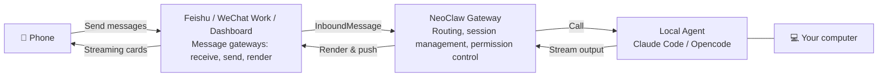

<div align="center">
  <h1> NeoClaw</h1>
  <p>
    <a href="LICENSE"></a>
    
    
  </p>
  <p>
    NeoClaw is a scalable AI super assistant designed with a Gateway architecture. It connects IM platforms like <strong>Feishu</strong> and <strong>WeChat Work</strong> to your existing local agents (<strong>Claude Code</strong>, <strong>Opencode</strong>, etc.).
  </p>
  <p>
    <a href="./README.zh-CN.draft.md">中文</a> | <strong>English</strong>
  </p>
  
</div>

## 📖 Table of Contents

- [📖 Table of Contents](#-table-of-contents)
- [✨ Features](#-features)
- [📦 Installation](#-installation)
- [🚀 Quick Start](#-quick-start)
- [🌐 Gateway Configuration](#-gateway-configuration)
- [⏰ Cron Jobs](#-cron-jobs)
- [🔌 MCP Servers \& Skills](#-mcp-servers--skills)
- [🧠 Memory System](#-memory-system)
- [🏗️ Architecture](#️-architecture)
- [🤝 Contributing](#-contributing)
- [📄 License](#-license)

## ✨ Features

- **Multiple AI backends**: Supports Claude Code (default) and Opencode, both with MCP Servers, Skills, streaming responses, and tool calls.
- **Multi-platform gateways**: Feishu (DM/group/topic), WeChat Work, and Web Dashboard; all three can run simultaneously.
- **Streaming responses**: Feishu uses streaming cards for a typewriter effect; Dashboard pushes deltas in real time; WeChat Work simulates streaming by chunking messages.
  <br/>
- **Requirement clarification**: Proactively opens interactive questionnaires via the `AskUserQuestion` tool.
  <br/>
- **Multimodal**: Supports Feishu image messages; the AI can directly understand image content.
  <br/>
- **Session isolation & concurrency control**: One working directory per conversation, plus a serial queue to prevent concurrent conflicts.
- **Cron jobs**: Supports cron expressions and one-off jobs, created directly from chat via the AI.
  <br/>
- **Three-layer memory system**: Identity, semantic knowledge, and episodic summaries, backed by SQLite FTS5 full-text search.
- **Self-evolving**: NeoClaw can modify its own code through conversation, and apply changes via the `/restart` command.
  <br/>
- **Slash commands**: `/clear` (clear session), `/restart` (restart service), `/status` (status), `/help` (help).

## 📦 Installation

**Prerequisites:**

- [Bun](https://bun.sh) v1.0+
- One AI backend:
  - [Claude Code](https://docs.anthropic.com/en/docs/agents-and-tools/claude-code/overview) (default)
  - [Opencode](https://opencode.ai)
- At least one messaging platform account (Feishu or WeChat Work)

```bash
# 1. Clone the repo
git clone https://github.com/amszuidas/neoclaw.git
cd neoclaw

# 2. Install dependencies
bun install

# 3. Link the CLI globally (for development)
bun link
```

After that, the `neoclaw` command is available globally:

| Command                     | Description              |
| --------------------------- | ------------------------ |
| `neoclaw onboard`           | Initialize configuration |
| `neoclaw start`             | Start the daemon         |
| `neoclaw stop`              | Stop the daemon          |
| `neoclaw cron <subcommand>` | Manage cron jobs         |

## 🚀 Quick Start

### Initialize

```bash
neoclaw onboard
```

### Configure

Edit `~/.neoclaw/config.json` and configure at least the AI backend and one gateway:

```jsonc
{
  "agent": {
    "type": "claude_code", // "claude_code" (default) or "opencode"
    "model": "claude-sonnet-4-6", // Optional Claude model override
    "timeoutSecs": 600,
  },
  // Configure either Feishu or WeChat Work (or both)
  "feishu": {
    "appId": "YOUR_FEISHU_APP_ID",
    "appSecret": "YOUR_FEISHU_APP_SECRET",
    "verificationToken": "",
    "encryptKey": "",
    "domain": "feishu", // "feishu" or "lark"
  },
  "wework": {
    "botId": "YOUR_WEWORK_BOT_ID",
    "secret": "YOUR_WEWORK_SECRET",
  },
  // Optional: enable Web Dashboard
  "dashboard": {
    "enabled": false,
    "port": 3000,
  },
}
```

> See how to obtain credentials in [Gateway Configuration](#-gateway-configuration).

### Start

```bash
neoclaw start
```

The service daemonizes automatically and runs in the background. Logs: `~/.neoclaw/logs/neoclaw.log`

```bash
# Stop
neoclaw stop

# Dev mode (auto-restart on file changes)
bun run dev
```

With Dashboard enabled, open `http://localhost:5173` in your browser to chat with NeoClaw.

## 🌐 Gateway Configuration

### Feishu

See [FEISHU_CONFIG.md](FEISHU_CONFIG.md) for detailed instructions.

**Config fields:**

| Field               | Description                                           |
| ------------------- | ----------------------------------------------------- |
| `appId`             | Feishu App ID                                         |
| `appSecret`         | Feishu App Secret                                     |
| `verificationToken` | Event subscription Verification Token                 |
| `encryptKey`        | Event subscription Encrypt Key (optional)             |
| `domain`            | `"feishu"` or `"lark"`                                |
| `groupAutoReply`    | Group chat ID list that auto-replies without @mention |

**Env var overrides:** `FEISHU_APP_ID`, `FEISHU_APP_SECRET`, `FEISHU_VERIFICATION_TOKEN`, `FEISHU_ENCRYPT_KEY`, `FEISHU_DOMAIN`, `FEISHU_GROUP_AUTO_REPLY`

**Key steps:**

1. Create an app in the [Feishu Open Platform](https://open.feishu.cn/)
2. Configure event subscriptions (message receive, card action callbacks)
3. Fill credentials into the config file

### WeChat Work

See [WEWORK_BOT.md](WEWORK_BOT.md) for detailed instructions.

**Config fields:**

| Field            | Description                                           |
| ---------------- | ----------------------------------------------------- |
| `botId`          | WeChat Work bot ID                                    |
| `secret`         | Bot secret                                            |
| `groupAutoReply` | Group chat ID list that auto-replies without @mention |

**Env var overrides:** `WEWORK_BOT_ID`, `WEWORK_SECRET`, `WEWORK_GROUP_AUTO_REPLY`

**Key steps:**

1. In the [WeChat Work Admin Console](https://work.weixin.qq.com/) -> Application Management -> Intelligent Assistant, create a bot
2. Choose **API mode** -> **Long connection**
3. Fill `botId` and `secret` into the config file

### Dashboard

```jsonc
{
  "dashboard": {
    "enabled": true,
    "port": 3000, // WebSocket server port
    "cors": true,
  },
}
```

**Env var overrides:** `NEOCLAW_DASHBOARD_ENABLED`, `NEOCLAW_DASHBOARD_PORT`, `NEOCLAW_DASHBOARD_CORS`

After starting, visit `http://localhost:5173` for real-time streaming responses, session management, Markdown rendering, and a thinking panel.

### Feature Comparison

| Feature                | Feishu          | WeChat Work                 | Dashboard             |
| ---------------------- | --------------- | --------------------------- | --------------------- |
| Connection             | WebSocket       | WebSocket (long connection) | WebSocket             |
| Streaming              | ✅ Native cards | ⚠️ Chunked messages         | ✅ Real-time push     |
| Interactive forms      | ✅              | ⚠️ Markdown format          | ❌                    |
| @mentions              | ✅              | ✅                          | ❌                    |
| Topic threads          | ✅              | ❌                          | ✅ Session management |
| Images/files           | ✅              | ✅                          | ❌                    |
| Public server required | ✅              | ❌                          | ✅                    |

## ⏰ Cron Jobs

In chat, the AI will automatically call the `neoclaw cron` command to create and manage jobs. You can also run it directly in your terminal:

```bash
# Create a one-off job
neoclaw cron create --message "Generate monthly report" --run-at "2024-03-01T09:00:00+08:00" --label "Monthly report"

# Create a recurring job (Mon-Fri 09:00)
neoclaw cron create --message "Daily morning brief" --cron-expr "0 9 * * 1-5" --label "Morning brief"

# List all jobs
neoclaw cron list

# Include disabled jobs
neoclaw cron list --include-disabled

# Delete a job
neoclaw cron delete --job-id <jobId>

# Update a job
neoclaw cron update --job-id <jobId> --label "New name" --enabled true
```

**Cron expression format** (5 fields): `min hour day month weekday`. For example, `0 9 * * 1-5` means 09:00 Monday to Friday.

## 🔌 MCP Servers & Skills

NeoClaw configures MCP Servers and Skills at a unified layer, translates them into the underlying agent formats, and **hot-loads** changes every time a new agent process starts (no daemon restart required).

### MCP Servers

Add entries under `mcpServers` in `~/.neoclaw/config.json`:

```jsonc
{
  "mcpServers": {
    "my-server": {
      "type": "stdio",
      "command": "npx",
      "args": ["-y", "@example/mcp-server"],
      "env": { "API_KEY": "xxx" },
    },
    "remote-server": {
      "type": "http",
      "url": "https://mcp.example.com/sse",
      "headers": { "Authorization": "Bearer xxx" },
    },
  },
}
```

Supported types: `stdio`, `http`, `sse`.

### Skills

Place skill directories under `~/.neoclaw/skills/` (customizable via `skillsDir` or the `NEOCLAW_SKILLS_DIR` env var). Each skill directory must include a `SKILL.md` file:

```
~/.neoclaw/skills/
  deploy/
    SKILL.md
  code-review/
    SKILL.md
```

Skills are synced into workspaces on new process start: newly added skills are linked, deleted skills are cleaned up, and edits to `SKILL.md` take effect immediately via symlinks.

## 🧠 Memory System

NeoClaw includes a built-in three-layer memory system, injected into each workspace via an MCP server (`neoclaw-memory`):

```
~/.neoclaw/memory/
├── identity/
│   └── SOUL.md       # Identity: personality, values, communication style
├── knowledge/        # Semantic memory: persistent knowledge by topic
├── episodes/         # Episodic memory: session summaries generated on session end
└── index.sqlite      # FTS5 full-text search index
```

| Category      | Description                              | When it is written                    |
| ------------- | ---------------------------------------- | ------------------------------------- |
| **identity**  | Personality, values, communication style | `memory_save` + `category="identity"` |
| **knowledge** | Persistent knowledge organized by topic  | `memory_save` + `topic`               |
| **episode**   | Session summary                          | Auto-generated on `/clear` or `/new`  |

**Four MCP tools:** `memory_search` (full-text search), `memory_read` (read file), `memory_save` (save content), `memory_list` (list memories)

**Memory rules:**

- Relevant memories are searched automatically at the start of each conversation to provide context
- Important owner information is saved into `knowledge` memory
- Other users can search but cannot write
- Memory contents are not leaked to non-owner users

## 🏗️ Architecture



## 🤝 Contributing

Issues and pull requests are welcome!

1. Fork this repository
2. Create a branch (`git checkout -b feature/AmazingFeature`)
3. Commit changes (`git commit -m 'Add some AmazingFeature'`)
4. Push to the branch (`git push origin feature/AmazingFeature`)
5. Open a pull request

## 📄 License

This project is open-sourced under the [Apache-2.0](LICENSE) license.
