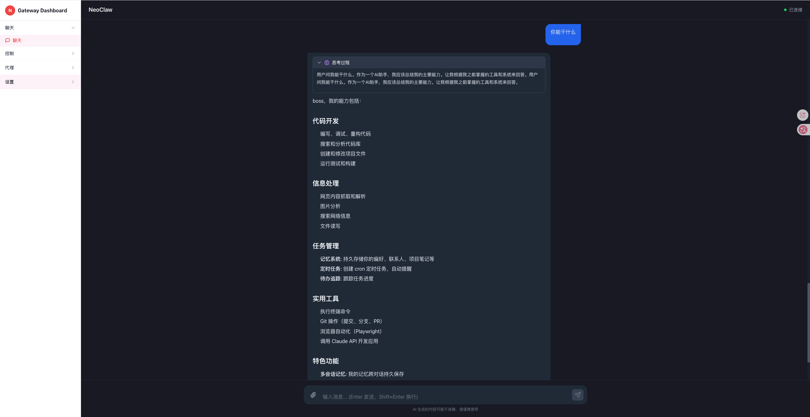
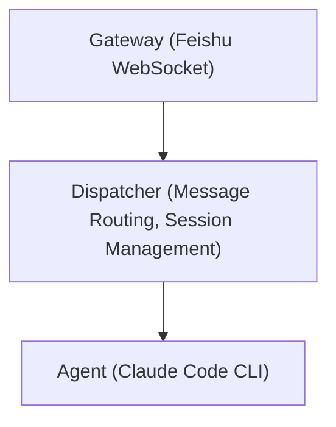

<div align="center">
  <h1> NeoClaw</h1>
  <p>
    <a href="LICENSE"></a>
    
    
  </p>
  <p>
    NeoClaw is a scalable AI super assistant designed with a Gateway architecture.<br/>
    It currently supports <strong>Feishu (Lark)</strong> and <strong>WeCom</strong> as messaging gateways, with <strong>Claude Code</strong> as the powerful AI backend.
  </p>
  <p>
    <a href="docs/README.zh-CN.md">中文</a> | <strong>English</strong>
  </p>
  
</div>

## 📖 Table of Contents

- [Features](#-features)
- [Quick Start](#-quick-start)
  - [Prerequisites](#prerequisites)
  - [Installation](#installation)
  - [Configuration](#configuration)
  - [Start Service](#start-service)
  - [Development Mode](#development-mode)
- [Architecture](#-architecture)
- [Cron Job CLI](#-cron-job-cli)
- [MCP Servers & Skills](#-mcp-servers--skills)
- [Memory System](#-memory-system)
- [Tech Stack](#-tech-stack)
- [Directory Structure](#-directory-structure)
- [Gateway Configuration](#gateway-configuration)
  - [Feishu Configuration](#feishu-configuration)
  - [WeCom Configuration](#wecom-configuration)
- [Contributing](#-contributing)
- [License](#-license)

## ✨ Features

- **Full Claude Code Support**: Powered by the world's most powerful Agent, seamlessly supporting everything from Claude Code (including Plugins, Skills, MCPs, etc.), delivering the most powerful AI capabilities.

- **Multi-Platform Support**: Currently supports Feishu (Lark), WeCom, and Gateway Dashboard.
  - **Feishu**: Perfectly adapts to various scenarios such as private chats, group chats, and topic groups.
  - **WeCom**: Supports enterprise messaging with HTTP callback integration.
  - **Dashboard**: Web-based interface for direct AI interaction through your browser.

- **Multi-Scenario Support**:
  - **Group Chat Support**: Mention @NeoClaw in group chats to trigger a reply.
    <br/>
  - **Topic Group Support**: Supports discussing multiple topics simultaneously in topic groups (Feishu only).
    <br/>

- **Streaming Response**:
  - **Feishu**: Uses streaming cards to achieve a typewriter-style streaming output.
  - **WeCom**: Simulates streaming with chunked message updates.
    <br/>

- **Clarification**: Supports interactive forms, utilizing Claude Code's `AskUserQuestion` tool to proactively clarify requirements.
  <br/>

- **Multi-modal Support**: Supports sending image messages in Feishu, with Claude Code directly understanding the image content.
  <br/>

- **Workspace Isolation**: Each conversation has an independent working directory (`~/.neoclaw/workspaces/<conversationId>`).

- **Concurrency Control**: Each session has an independent locking queue to ensure messages are processed in order, avoiding concurrency conflicts.

- **Scheduled Tasks**: Supports creating and managing scheduled tasks using Cron expressions.
  <br/>

- **Three-layer Memory System**:
  - **Identity Memory** (`identity/SOUL.md`): Personality, values, communication style.
  - **Semantic Memory** (`knowledge/`): Persistent knowledge organized by topic, with FTS5 search.
  - **Episodic Memory** (`episodes/`): Auto-generated session summaries on `/clear` or `/new`.

- **Self-Evolution**: Supports modifying its own code through conversation and applying changes via the `/restart` command for continuous evolution.

- **Slash Commands**:
  - `/clear`: Clear current session memory.
  - `/restart`: Restart the service.
    <br/>
  - `/status`: View current status.
  - `/help`: Get help information.

## 🚀 Quick Start

### Prerequisites

- [Bun](https://bun.sh) (v1.0+)
- **Claude Code**: Please refer to the [Claude Code Installation Guide](https://docs.anthropic.com/en/docs/agents-and-tools/claude-code/overview) for installation and configuration.
  > **Note**: If you do not want to subscribe to Claude Code, you can configure `~/.claude/settings.json` to use a custom API:
  >
  > ```json
  > {
  >   "env": {
  >     "ANTHROPIC_BASE_URL": "xxx",
  >     "ANTHROPIC_AUTH_TOKEN": "xxx",
  >     "ANTHROPIC_MODEL": "xxx",
  >     "ANTHROPIC_SMALL_FAST_MODEL": "xxx",
  >     "CLAUDE_CODE_DISABLE_NONESSENTIAL_TRAFFIC": "1",
  >     "API_TIMEOUT_MS": "600000"
  >   }
  > }
  > ```
- **At least one messaging platform**: Either Feishu (Lark) or WeCom account and app.

### Installation

```bash
bun install
```

### Configuration

1. Generate configuration file template:

```bash
bun onboard
```

2. Edit `~/.neoclaw/config.json`:

> **Tip**: Configure **either Feishu (Lark)** or **WeCom**. Both gateways can be enabled simultaneously if needed.

```jsonc
{
  "agent": {
    "type": "claude_code",
    "model": "claude-sonnet-4-6", // Custom Claude Model
    "systemPrompt": "", // Custom System Prompt
    "allowedTools": [], // List of Allowed Tools
    "timeoutSecs": 600, // Timeout (seconds)
  },
  "feishu": {
    "appId": "your_app_id", // Feishu App ID (optional if using WeCom)
    "appSecret": "your_app_secret", // Feishu App Secret (optional if using WeCom)
    "verificationToken": "", // Event Subscription Verification Token
    "encryptKey": "", // Event Subscription Encrypt Key
    "domain": "feishu", // "feishu" or "lark"
    "groupAutoReply": [], // List of Group IDs for Auto-Reply
  },
  "wework": {
    "botId": "xxxxxxxx-xxxx-xxxx-xxxx-xxxxxxxxxxxx", // WeCom Bot ID
    "secret": "xxxxxxxxxxxxxxxxxxxxxxxxxxxxxxxxx", // WeCom Bot Secret
    "groupAutoReply": [], // List of Group IDs for Auto-Reply
  },
  "dashboard": {
    "enabled": true, // Enable Dashboard Gateway
    "port": 3000, // Backend WebSocket server port
    "cors": true, // Enable CORS
  },
  "mcpServers": {
    // MCP Servers (hot-reloaded on new process)
    "example-server": {
      "type": "stdio",
      "command": "npx",
      "args": ["-y", "@example/mcp-server"],
    },
  },
  "skillsDir": "~/.neoclaw/skills", // Skills directory
  "logLevel": "info",
  "workspacesDir": "~/.neoclaw/workspaces",
  "fileBlacklist": [
    // File access blacklist - prevents agent from reading/writing sensitive files
    "~/.claude/settings.json",           // Claude Code settings
    "~/.config/claude/settings.json",    // Alternative Claude config location
    "/etc/shadow",            // System password file
    "/etc/passwd",            // System user file
    "**/.env",                // Environment variable files
    "**/credentials.json",    // Credential files
    "**/secrets/**",          // Secrets directories
    "~/.neoclaw/config.json", // NeoClaw config file (protects blacklist itself)
    "~/.neoclaw/config.json.backup", // Config backups
  ],
}
```

#### File Blacklist

The `fileBlacklist` configuration prevents the agent from accessing sensitive files and directories. It supports glob patterns:

- `~` is expanded to the user's home directory
- `**` matches any number of directories
- `*` matches any characters except `/`
- `?` matches any single character

**Default blacklist includes:**
- Claude Code configuration (`~/.claude/**`, `~/.config/claude/**`)
- System files (`/etc/passwd`, `/etc/shadow`)
- Environment files (`**/.env`)
- Credentials (`**/credentials.json`)
- Secrets (`**/secrets/**`)
- NeoClaw configuration (`~/.neoclaw/config.json`) - **protects the blacklist itself**

You can customize the blacklist via:
- Configuration file: `fileBlacklist` array
- Environment variable: `NEOCLAW_FILE_BLACKLIST` (comma-separated patterns)

### Start Service

```bash
bun start
```

The service will automatically daemonize and run in the background, with logs output to `~/.neoclaw/logs/neoclaw.log`.

### Access Dashboard

If you have enabled the Dashboard Gateway in your configuration:

```jsonc
{
  "dashboard": {
    "enabled": true,
    "port": 3000,
  },
}
```

After starting the service, open your browser and visit:

```
http://localhost:5173
```

The Dashboard provides a web interface for chatting with NeoClaw, supporting:

- Real-time streaming responses
- Session management
- Markdown rendering with syntax highlighting
- Thinking panel for Claude's reasoning process
  <br/>

### Development Mode

```bash
bun run dev
```

Watches for file changes and automatically restarts, suitable for development and debugging.

## 🏗️ Architecture

Adopts the Gateway pattern, separating I/O adaptation and AI processing to ensure system flexibility and scalability:



### Core Components

- **Gateway**: Messaging platform adapter, responsible for handling Feishu WebSocket connections, message parsing, and card rendering.
- **Dispatcher**: Message router, manages session queues, handles slash commands, and coordinates Agent work.
- **Agent**: AI backend wrapper, communicates via Claude Code CLI's JSONL stream protocol.
- **CronScheduler**: Scheduled task scheduler, supports complex scheduled task management.

### Message Flow

1. **Receive**: Gateway receives Feishu message events and parses them into `InboundMessage`.
2. **Initialize**: Creates `reply` closure and `streamHandler` closure.
3. **Dispatch**: Dispatcher acquires session lock to prevent concurrent processing conflicts.
4. **Execute**: Checks for slash commands; if none, calls `Agent.stream()` or `Agent.run()`.
5. **Feedback**: Streaming events are pushed in real-time via `streamHandler` to Gateway for card rendering.

## ⏰ Cron Job CLI

NeoClaw includes powerful scheduled task management capabilities:

```bash
# Create a one-time task
neoclaw-cron create --message "Task Description" --run-at "2024-03-01T09:00:00+08:00"

# Create a recurring task (Mon-Fri 09:00)
neoclaw-cron create --message "Task Description" --cron-expr "0 9 * * 1-5"

# List all tasks
neoclaw-cron list

# Delete a task
neoclaw-cron delete --job-id <jobId>

# Update a task
neoclaw-cron update --job-id <jobId> [--label "New Name"] [--enabled true|false]
```

## 🔌 MCP Servers & Skills

NeoClaw supports agent-agnostic configuration for MCP Servers and Skills. Configurations are defined at the NeoClaw level and automatically translated into the format required by the underlying agent (e.g., Claude Code).

### MCP Servers

Add MCP servers in `~/.neoclaw/config.json` under the `mcpServers` field:

```jsonc
{
  "mcpServers": {
    "my-server": {
      "type": "stdio",
      "command": "npx",
      "args": ["-y", "@example/mcp-server"],
      "env": { "API_KEY": "xxx" },
    },
    "remote-server": {
      "type": "http",
      "url": "https://mcp.example.com/sse",
      "headers": { "Authorization": "Bearer xxx" },
    },
  },
}
```

MCP configuration is **hot-reloaded** from the config file each time a new Claude Code process starts — no daemon restart required.

### Skills

Place skill directories under `~/.neoclaw/skills/` (configurable via `skillsDir` or `NEOCLAW_SKILLS_DIR` env var). Each skill directory must contain a `SKILL.md` file:

```
~/.neoclaw/skills/
  deploy/
    SKILL.md
  code-review/
    SKILL.md
```

Skills are automatically synced to each workspace on new process start: new skills are linked, removed skills are cleaned up, and modified `SKILL.md` content takes effect immediately (via symlinks).

## 🧠 Memory System

NeoClaw has a three-layer memory system with SQLite FTS5 full-text indexing, exposed as a built-in MCP server (`neoclaw-memory`) that provides four tools: `memory_search`, `memory_read`, `memory_save`, `memory_list`:

```
~/.neoclaw/memory/
├── identity/
│   └── SOUL.md          # Identity: personality, values, communication style
├── knowledge/           # Knowledge: topic-organized persistent knowledge
├── episodes/            # Episodes: auto-generated session summaries
└── index.sqlite         # FTS5 full-text search index
```

All memory files use the same frontmatter format (`title`, `date`, `tags`).

| Category      | Description                              | Read                                            | Write                                    |
| ------------- | ---------------------------------------- | ----------------------------------------------- | ---------------------------------------- |
| **identity**  | Personality, values, communication style | `memory_read` / `memory_search` / `memory_list` | `memory_save` with `category="identity"` |
| **knowledge** | Topic-organized persistent knowledge     | `memory_read` / `memory_search` / `memory_list` | `memory_save` with `topic` + `content`   |
| **episode**   | Auto-generated session summaries         | `memory_read` / `memory_search` / `memory_list` | Automatic on `/clear` or `/new`          |

### MCP Server Integration

The memory system runs as a standalone stdio MCP server (`neoclaw-memory`), automatically injected into each workspace's `.mcp.json` alongside user-configured MCP servers. Claude Code communicates with it directly through the MCP protocol — no tool interception needed.

### Index Updates

- **On startup**: Full reindex from disk
- **Every 5 minutes**: Periodic reindex to capture external file changes
- **On `memory_save`**: Immediate upsert
- **On `/clear` or `/new`**: Session summary generated and indexed

### Session Summarization

When `/clear` or `/new` is used, the dispatcher generates an episodic memory entry:

1. Reads conversation history from `.history/` (only new content since last summary, tracked via `.last-summarized-offset`)
2. Calls Claude (haiku model) to produce a structured summary
3. Saves to `episodes/` and updates the FTS5 index

### Memory Rules

- At conversation start, the agent searches memory for relevant context
- Owner's important information is saved to knowledge memory
- Other users can search but not save
- Memory content is never leaked to non-owner users

## 📚 Tech Stack

- **Runtime**: [Bun](https://bun.sh) (High-performance JavaScript Runtime)
- **Language**: TypeScript (Strict Mode)
- **SDK**: `@larksuiteoapi/node-sdk`, Native fetch for WeCom
- **Linting**: ESLint + Prettier

## 📂 Directory Structure

```
neoclaw/
├── src/
│   ├── agents/           # AI Agent Implementation (Claude Code)
│   ├── cli/              # CLI Tools (Cron Management)
│   ├── cron/             # Scheduled Task Core Logic
│   ├── gateway/          # Messaging Gateway Adapter
│   │   ├── feishu/       # Feishu Adapter Implementation
│   │   └── wework/       # WeCom Adapter Implementation
│   ├── templates/        # Memory and Configuration Templates
│   ├── utils/            # General Utility Functions
│   ├── config.ts         # Configuration Management
│   ├── daemon.ts         # Daemon Process Logic
│   ├── dispatcher.ts     # Message Dispatch Core
│   └── index.ts          # Program Entry
├── docs/                 # Documentation
│   ├── CLAUDE.md         # Claude Code Guide
│   ├── FEISHU_CONFIG.md  # Feishu Configuration Guide
│   ├── WEWORK_BOT.md     # WeCom Configuration Guide
│   └── README.zh-CN.md   # Chinese README
└── package.json
```

## 🌐 Gateway Configuration

### Dashboard Configuration

The Dashboard Gateway provides a web-based interface for interacting with NeoClaw directly in your browser. Enable it in `~/.neoclaw/config.json`:

```jsonc
{
  "dashboard": {
    "enabled": true, // Enable Dashboard Gateway
    "port": 3000, // Backend WebSocket server port (default: 3000)
    "cors": true, // Enable CORS (default: true)
  },
}
```

**Environment variables:**

- `NEOCLAW_DASHBOARD_ENABLED`: Set to `true` to enable
- `NEOCLAW_DASHBOARD_PORT`: Port number for backend server
- `NEOCLAW_DASHBOARD_CORS`: Set to `false` to disable CORS

**Access URLs:**

- Frontend: `http://localhost:5173`
- WebSocket: `ws://localhost:3000/ws`

### Feishu Configuration

For detailed instructions on configuring Feishu (Lark), see [FEISHU_CONFIG.md](docs/FEISHU_CONFIG.md).

Key steps:

1. Create a Feishu app at [Feishu Open Platform](https://open.feishu.cn/)
2. Configure event subscriptions (message receive, card action trigger)
3. Get `appId`, `appSecret`, `verificationToken`, `encryptKey`
4. Update `~/.neoclaw/config.json` with your credentials

### WeCom Configuration

For detailed instructions on configuring WeCom, see [WEWORK_BOT.md](docs/WEWORK_BOT.md).

Key steps:

1. Create a Bot at [WeCom Management Console](https://work.weixin.qq.com/) → Application Management → Smart Assistant
2. Choose **API Mode** → **Long Connection Method**
3. Get `botId` and `secret`
4. Update `~/.neoclaw/config.json` with your credentials

**Note**: All three gateways can be configured and used simultaneously if needed.

### Platform Feature Comparison

| Feature           | Feishu            | WeCom Bot                   | Dashboard              |
| ----------------- | ----------------- | --------------------------- | ---------------------- |
| Connection        | WebSocket         | WebSocket (Long Connection) | WebSocket              |
| Streaming Cards   | ✅ Native support | ⚠️ Chunked messages         | ✅ Real-time streaming |
| Interactive Forms | ✅ Card buttons   | ⚠️ Markdown format          | ❌                     |
| @Mentions         | ✅                | ✅                          | ❌                     |
| Threads           | ✅                | ❌                          | ✅ Session management  |
| Images/Files      | ✅                | ✅                          | ❌                     |
| Server Required   | ✅ Yes            | ❌ No                       | ✅ Yes                 |

## 🤝 Contributing

Issues and Pull Requests are welcome!

1. Fork this repository
2. Create your feature branch (`git checkout -b feature/AmazingFeature`)
3. Commit your changes (`git commit -m 'Add some AmazingFeature'`)
4. Push to the branch (`git push origin feature/AmazingFeature`)
5. Open a Pull Request

## 📄 License

This project is open-sourced under the [Apache-2.0](LICENSE) license.
