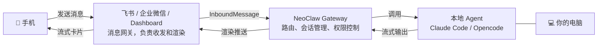

<div align="center">
  <h1> NeoClaw</h1>
  <p>
    <a href="../LICENSE"></a>
    
    
  </p>
  <p>
    NeoClaw 是一个基于 Gateway 架构设计的可扩展 AI 超级助手。支持把<strong>飞书</strong>、<strong>企业微信</strong>等即时通讯工具连接到你本地已有的 Agent (<strong>Claude Code</strong>, <strong>Opencode</strong> 等)
  </p>
  <p>
    <strong>中文</strong> | <a href="../README.md">English</a>
  </p>
  
</div>

## 📖 目录

- [📖 目录](#-目录)
- [✨ 功能特性](#-功能特性)
- [📦 安装](#-安装)
- [🚀 快速开始](#-快速开始)
- [🌐 网关配置](#-网关配置)
- [⏰ 定时任务](#-定时任务)
- [🔌 MCP Servers \& Skills](#-mcp-servers--skills)
- [🧠 记忆系统](#-记忆系统)
- [🏗️ 架构](#架构)
- [🤝 贡献指南](#-贡献指南)
- [📄 许可证](#-许可证)


## ✨ 功能特性

- **多 AI 后端**：支持 Claude Code（默认）和 Opencode，均支持 MCP Servers、Skills、流式响应和工具调用。
- **多平台支持**：飞书（私聊/群聊/话题群）、企业微信、Web Dashboard，三种网关可同时运行。
- **流式响应**：飞书使用流式卡片实现打字机效果；Dashboard 实时推送；企业微信模拟流式输出。
  <br/>
- **问题澄清**：通过 `AskUserQuestion` 工具主动弹出交互式问卷，澄清需求。
  <br/>
- **多模态支持**：支持飞书图片消息，AI 可直接理解图片内容。
  <br/>
- **会话隔离 & 并发控制**：每个会话独立工作目录，串行队列防止并发冲突。
- **定时任务**：支持 Cron 表达式和一次性任务，在对话中通过 AI 直接创建。
  <br/>
- **三层记忆系统**：身份记忆、语义记忆、情景记忆，基于 SQLite FTS5 全文检索。
- **自进化能力**：支持通过对话让 NeoClaw 修改自身代码，并通过 `/restart` 命令重启生效，实现持续进化。
  <br/>
- **斜杠命令**：`/clear`（清除会话）、`/restart`（重启服务）、`/status`（查看状态）、`/help`（帮助）。

## 📦 安装

**前置要求：**
- [Bun](https://bun.sh) v1.0+
- AI 后端（任选其一）：
  - [Claude Code](https://docs.anthropic.com/en/docs/agents-and-tools/claude-code/overview)（默认）
  - [Opencode](https://opencode.ai)
- 至少一个消息平台账号（飞书或企业微信）

```bash
# 1. 克隆仓库
git clone https://github.com/amszuidas/neoclaw.git
cd neoclaw

# 2. 安装依赖
bun install

# 3. 全局链接 CLI（开发阶段）
bun link
```

完成后 `neoclaw` 命令即可在终端全局使用：

| 命令 | 说明 |
| --- | --- |
| `neoclaw onboard` | 初始化配置 |
| `neoclaw start` | 启动后台进程 |
| `neoclaw stop` | 停止后台进程 |
| `neoclaw cron <子命令>` | 管理定时任务 |

## 🚀 快速开始

### 初始化

```bash
neoclaw onboard
```

### 配置

编辑 `~/.neoclaw/config.json`，至少配置 AI 后端和一个消息网关：

```jsonc
{
  "agent": {
    "type": "claude_code",        // "claude_code"（默认）或 "opencode"
    "model": "claude-sonnet-4-6", // Claude 模型（可选）
    "timeoutSecs": 600
  },
  // 配置飞书或企业微信其中之一（或两者）
  "feishu": {
    "appId": "YOUR_FEISHU_APP_ID",
    "appSecret": "YOUR_FEISHU_APP_SECRET",
    "verificationToken": "",
    "encryptKey": "",
    "domain": "feishu"            // "feishu" 或 "lark"
  },
  "wework": {
    "botId": "YOUR_WEWORK_BOT_ID",
    "secret": "YOUR_WEWORK_SECRET"
  },
  // 可选：启用 Web Dashboard
  "dashboard": {
    "enabled": false,
    "port": 3000
  }
}
```

> 各平台凭证获取方式见 [网关配置](#-网关配置) 章节。

### 启动服务

```bash
neoclaw start
```

服务自动守护进程化，后台运行。日志路径：`~/.neoclaw/logs/neoclaw.log`

```bash
# 停止服务
neoclaw stop

# 开发模式（文件变更自动重启）
bun run dev
```

启用 Dashboard 后，浏览器访问 `http://localhost:5173` 即可直接与 NeoClaw 对话。

## 🌐 网关配置

### 飞书

详细说明见 [FEISHU_CONFIG.md](FEISHU_CONFIG.md)。

**配置字段：**

| 字段 | 说明 |
| --- | --- |
| `appId` | 飞书应用 App ID |
| `appSecret` | 飞书应用 App Secret |
| `verificationToken` | 事件订阅 Verification Token |
| `encryptKey` | 事件订阅 Encrypt Key（可选） |
| `domain` | `"feishu"` 或 `"lark"` |
| `groupAutoReply` | 无需 @mention 即自动回复的群聊 ID 列表 |

**环境变量覆盖：** `FEISHU_APP_ID`, `FEISHU_APP_SECRET`, `FEISHU_VERIFICATION_TOKEN`, `FEISHU_ENCRYPT_KEY`, `FEISHU_DOMAIN`, `FEISHU_GROUP_AUTO_REPLY`

**关键步骤：**
1. 在[飞书开放平台](https://open.feishu.cn/)创建应用
2. 配置事件订阅（消息接收、卡片动作触发）
3. 将凭证填入配置文件

### 企业微信

详细说明见 [WEWORK_BOT.md](WEWORK_BOT.md)。

**配置字段：**

| 字段 | 说明 |
| --- | --- |
| `botId` | 企业微信机器人 ID |
| `secret` | 机器人 Secret |
| `groupAutoReply` | 无需 @mention 即自动回复的群聊 ID 列表 |

**环境变量覆盖：** `WEWORK_BOT_ID`, `WEWORK_SECRET`, `WEWORK_GROUP_AUTO_REPLY`

**关键步骤：**
1. 在[企业微信管理后台](https://work.weixin.qq.com/) → 应用管理 → 智能助手创建机器人
2. 选择 **API 模式** → **长连接方式**
3. 将 `botId` 和 `secret` 填入配置文件

### Dashboard

```jsonc
{
  "dashboard": {
    "enabled": true,
    "port": 3000,   // WebSocket 服务端口
    "cors": true
  }
}
```

**环境变量覆盖：** `NEOCLAW_DASHBOARD_ENABLED`, `NEOCLAW_DASHBOARD_PORT`, `NEOCLAW_DASHBOARD_CORS`

启动后访问 `http://localhost:5173`，支持实时流式响应、会话管理、Markdown 渲染和思考面板。

### 平台功能对比

| 功能 | 飞书 | 企业微信 | Dashboard |
| --- | --- | --- | --- |
| 连接方式 | WebSocket | WebSocket（长连接） | WebSocket |
| 流式响应 | ✅ 原生卡片 | ⚠️ 分块消息 | ✅ 实时推送 |
| 交互式问卷 | ✅ | ⚠️ Markdown 格式 | ❌ |
| @提及 | ✅ | ✅ | ❌ |
| 话题线程 | ✅ | ❌ | ✅ 会话管理 |
| 图片/文件 | ✅ | ✅ | ❌ |
| 需要公网服务器 | ✅ | ❌ | ✅ |

## ⏰ 定时任务

在对话中，AI 会自动调用 `neoclaw cron` 命令创建和管理定时任务。你也可以直接在终端操作：

```bash
# 创建一次性任务
neoclaw cron create --message "生成月报" --run-at "2024-03-01T09:00:00+08:00" --label "月报"

# 创建循环任务（周一至周五 09:00）
neoclaw cron create --message "每日晨报" --cron-expr "0 9 * * 1-5" --label "晨报"

# 列出所有任务
neoclaw cron list

# 列出包含已禁用的任务
neoclaw cron list --include-disabled

# 删除任务
neoclaw cron delete --job-id <jobId>

# 更新任务
neoclaw cron update --job-id <jobId> --label "新名称" --enabled true
```

**Cron 表达式格式**（5 字段）：`分 时 日 月 周`，例如 `0 9 * * 1-5` 表示周一至周五 9:00。

## 🔌 MCP Servers & Skills

NeoClaw 在统一层面配置 MCP Servers 和 Skills，自动翻译为底层 Agent 所需格式，并在每次新进程启动时**热加载**，无需重启 daemon。

### MCP Servers

在 `~/.neoclaw/config.json` 的 `mcpServers` 字段中添加：

```jsonc
{
  "mcpServers": {
    "my-server": {
      "type": "stdio",
      "command": "npx",
      "args": ["-y", "@example/mcp-server"],
      "env": { "API_KEY": "xxx" }
    },
    "remote-server": {
      "type": "http",
      "url": "https://mcp.example.com/sse",
      "headers": { "Authorization": "Bearer xxx" }
    }
  }
}
```

支持 `stdio`、`http`、`sse` 三种类型。

### Skills

将 Skill 目录放置在 `~/.neoclaw/skills/` 下（可通过 `skillsDir` 或 `NEOCLAW_SKILLS_DIR` 环境变量自定义），每个 Skill 目录须包含 `SKILL.md` 文件：

```
~/.neoclaw/skills/
  deploy/
    SKILL.md
  code-review/
    SKILL.md
```

Skills 在新进程启动时自动同步到各工作区：新增的 Skill 会被链接，已删除的 Skill 会被清理，修改 `SKILL.md` 内容通过符号链接立即生效。

## 🧠 记忆系统

NeoClaw 内置三层记忆系统，通过 MCP 服务器（`neoclaw-memory`）自动注入每个工作区：

```
~/.neoclaw/memory/
├── identity/
│   └── SOUL.md       # 身份记忆：性格、价值观、沟通风格
├── knowledge/        # 语义记忆：按主题组织的持久化知识
├── episodes/         # 情景记忆：会话结束时自动生成的摘要
└── index.sqlite      # FTS5 全文检索索引
```

| 类别 | 说明 | 写入时机 |
| --- | --- | --- |
| **identity** | 性格、价值观、沟通风格 | `memory_save` + `category="identity"` |
| **knowledge** | 按主题组织的持久化知识 | `memory_save` + `topic` |
| **episode** | 会话摘要 | `/clear` 或 `/new` 时自动生成 |

**四个 MCP 工具：** `memory_search`（全文检索）、`memory_read`（读取文件）、`memory_save`（保存内容）、`memory_list`（列出记忆）

**记忆规则：**
- 每次对话开始时自动检索相关记忆作为上下文
- 主人的重要信息保存到 knowledge 记忆
- 其他用户可检索但不可写入
- 记忆内容不会泄露给非主人用户

## 🏗️ 架构



## 🤝 贡献指南

欢迎提交 Issue 和 Pull Request！

1. Fork 本仓库
2. 创建新分支（`git checkout -b feature/AmazingFeature`）
3. 提交更改（`git commit -m 'Add some AmazingFeature'`）
4. 推送到分支（`git push origin feature/AmazingFeature`）
5. 开启 Pull Request

## 📄 许可证

本项目基于 [Apache-2.0](../LICENSE) 协议开源。
