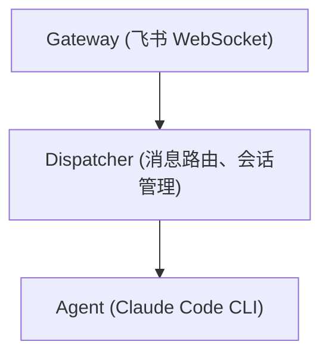

<div align="center">
  <h1> NeoClaw</h1>
  <p>
    <a href="LICENSE"></a>
    
    
  </p>
  <p>
    NeoClaw 是一个基于 Gateway 架构设计的可扩展 AI 超级助手。<br/>
    目前支持将 <strong>飞书</strong> 和 <strong>企业微信</strong> 作为消息网关，<strong>Claude Code</strong> 和 <strong>Opencode</strong> 作为 AI 后端。
  </p>
  <p>
    <strong>中文</strong> | <a href="../README.md">English</a>
  </p>
  
</div>

## 📖 目录

- [功能特性](#-功能特性)
- [快速开始](#-快速开始)
  - [前置要求](#前置要求)
  - [安装依赖](#安装依赖)
  - [配置](#配置)
  - [启动服务](#启动服务)
  - [开发模式](#开发模式)
- [架构设计](#-架构设计)
- [定时任务 CLI](#-定时任务-cli)
- [MCP Servers 与 Skills](#-mcp-servers-与-skills)
- [记忆系统](#-记忆系统)
- [技术栈](#-技术栈)
- [目录结构](#-目录结构)
- [网关配置](#-网关配置)
  - [飞书配置](#-飞书配置)
  - [企业微信配置](#-企业微信配置)
- [贡献指南](#-贡献指南)
- [许可证](#-许可证)

## ✨ 功能特性

- **多 AI 后端支持**: 可选 **Claude Code** 或 **Opencode** 作为 AI 后端，两者均支持 MCP Servers、Skills、流式响应和工具调用。
  - **Claude Code** (`claude_code`): 通过长驻子进程与 Claude Code CLI 通信（JSONL 流式协议）。支持会话持久化、图片附件、AskUserQuestion 交互式表单。
  - **Opencode** (`opencode`): 通过 SDK 与 [Opencode](https://opencode.ai) 本地服务通信。支持多提供商模型和推理输出（reasoning）。

- **多平台支持**: 目前支持飞书、企业微信和 Gateway Dashboard。
  - **飞书**: 完美适配私聊、群聊、话题群等多种场景。
  - **群聊支持**: 在群聊中 @NeoClaw 即可唤起回复。
    <br/>
  - **话题群支持**: 支持在话题群中同时进行多个话题的讨论。
    <br/>
  - **Dashboard**: 基于 Web 的界面，可直接在浏览器中与 AI 对话。

- **流式响应**:
  - **飞书**: 利用流式卡片实现打字机效果的流畅输出。
  - **企业微信**: 通过分块消息更新模拟流式输出。
    <br/>

- **问题澄清**: 支持交互式问卷，利用 Claude Code 的 `AskUserQuestion` 工具主动澄清需求。
  <br/>

- **多模态支持**: 支持飞书发送图片消息，Claude Code 可直接理解图片内容。
  <br/>

- **工作区隔离**: 每个会话拥有独立的工作目录 (`~/.neoclaw/workspaces/<conversationId>`)

- **并发控制**: 每个会话拥有独立的加锁队列，确保消息按顺序处理，避免并发冲突。

- **定时任务**: 支持 Cron 表达式创建和管理定时任务。
  <br/>

- **三层记忆系统**:
  - **身份记忆** (`identity/SOUL.md`): 性格、价值观、沟通风格
  - **语义记忆** (`knowledge/`): 按主题组织的持久化知识，支持 FTS5 全文搜索
  - **情景记忆** (`episodes/`): `/clear` 或 `/new` 时自动生成的会话摘要

- **自进化能力**: 支持通过对话让 NeoClaw 修改自身代码，并通过 `/restart` 命令重启生效，实现持续进化。

- **斜杠命令**:
  - `/clear`: 清除当前会话记忆
  - `/restart`: 重启服务
    <br/>
  - `/status`: 查看当前状态
  - `/help`: 获取帮助信息

## 🚀 快速开始

### 前置要求

- [Bun](https://bun.sh) (v1.0+)
- **AI 后端**（选择其一或同时安装）：
  - **Claude Code**（默认）：请参考 [Claude Code 安装说明](https://docs.anthropic.com/en/docs/agents-and-tools/claude-code/overview) 进行安装和配置。
    > **注意**: 如果你不想订阅 Claude Code，可以通过配置 `~/.claude/settings.json` 来使用自定义 API：
    >
    > ```json
    > {
    >   "env": {
    >     "ANTHROPIC_BASE_URL": "xxx",
    >     "ANTHROPIC_AUTH_TOKEN": "xxx",
    >     "ANTHROPIC_MODEL": "xxx",
    >     "ANTHROPIC_SMALL_FAST_MODEL": "xxx",
    >     "CLAUDE_CODE_DISABLE_NONESSENTIAL_TRAFFIC": "1",
    >     "API_TIMEOUT_MS": "600000"
    >   }
    > }
    > ```
  - **Opencode**：安装 [Opencode CLI](https://opencode.ai) 并配置你偏好的 AI 提供商。
- 飞书开放平台账号及应用（需配置相应的权限和事件订阅），详细配置请参考 [飞书机器人配置指南](FEISHU_CONFIG.md)。
- 关于配置企业微信智能助手的详细说明，请参阅 [企业微信机器人配置指南](WEWORK_BOT.md)。

### 安装依赖

```bash
bun install
```

### 配置

1. 生成配置文件模板：

```bash
bun onboard
```

2. 编辑 `~/.neoclaw/config.json`：

> **提示**:

- 配置 **飞书** 或 **企业微信** 任一平台即可。如需要，可同时启用两个网关。
- 关于如何获取飞书应用的 `appId`、`appSecret` 等信息，请详细阅读 [飞书机器人配置指南](FEISHU_CONFIG.md)。
- 关于如何获取企业微信机器人的 `botId`、`secret` 等信息，请详细阅读 [企业微信机器人配置指南](WEWORK_BOT.md)。

```jsonc
{
  "agent": {
    // AI 后端："claude_code"（默认）或 "opencode"
    "type": "claude_code",
    "model": "claude-sonnet-4-6", // 自定义 Claude 模型
    "systemPrompt": "", // 自定义系统提示词
    "allowedTools": [], // 允许的工具列表
    "timeoutSecs": 600, // 超时时间（秒）
    // Opencode 专属选项（仅 type 为 "opencode" 时生效）
    "opencode": {
      "model": {
        "providerID": "anthropic", // 提供商 ID（如 "anthropic"、"openai"）
        "modelID": "claude-sonnet-4-5", // 该提供商支持的模型 ID
      },
    },
  },
  "feishu": {
    "appId": "your_app_id", // 飞书应用 App ID（使用企业微信时可选）
    "appSecret": "your_app_secret", // 飞书应用 App Secret（使用企业微信时可选）
    "verificationToken": "", // 事件订阅 Verification Token
    "encryptKey": "", // 事件订阅 Encrypt Key
    "domain": "feishu", // "feishu" 或 "lark"
    "groupAutoReply": [], // 自动回复的群聊ID列表
  },
  "wework": {
    "botId": "xxxxxxxx-xxxx-xxxx-xxxx-xxxxxxxxxxxx", // 企业微信机器人 ID
    "secret": "xxxxxxxxxxxxxxxxxxxxxxxxxxxxxxxxx", // 企业微信机器人 Secret
    "groupAutoReply": [], // 自动回复的群聊ID列表
  },
  "dashboard": {
    "enabled": true, // 启用 Gateway Dashboard
    "port": 3000, // 后端 WebSocket 服务器端口
    "cors": true, // 启用 CORS
  },
  "mcpServers": {
    // MCP Servers（新进程启动时热加载）
    "example-server": {
      "type": "stdio",
      "command": "npx",
      "args": ["-y", "@example/mcp-server"],
    },
  },
  "skillsDir": "~/.neoclaw/skills", // Skills 目录
  "logLevel": "info",
  "workspacesDir": "~/.neoclaw/workspaces",
}
```

### 启动服务

```bash
bun start
```

服务将自动守护进程化，后台运行，日志输出到 `~/.neoclaw/logs/neoclaw.log`。

### 访问 Dashboard

如果您在配置中启用了 Dashboard Gateway：

```jsonc
{
  "dashboard": {
    "enabled": true,
    "port": 3000,
  },
}
```

启动服务后，在浏览器中访问：

```
http://localhost:5173
```

Dashboard 提供 Web 界面与 NeoClaw 对话，支持：

- 实时流式响应
- 会话管理
- Markdown 渲染与代码高亮
- 思考面板（展示 Claude 的推理过程）

### 开发模式

```bash
bun run dev
```

监听文件变化并自动重启，适合开发调试。

## 🏗️ 架构设计

采用 Gateway 模式，分离 I/O 适配和 AI 处理，保证系统的灵活性和可扩展性：



### 核心组件

- **Gateway**: 消息平台适配器，负责处理飞书 WebSocket 连接、消息解析、卡片渲染。
- **Dispatcher**: 消息路由器，管理会话队列、处理斜杠命令、协调 Agent 工作。
- **Agent**: AI 后端封装，通过 Claude Code CLI 的 JSONL 流协议进行通信。
- **CronScheduler**: 定时任务调度器，支持复杂的定时任务管理。

### 消息流程

1. **接收**: Gateway 接收飞书消息事件，解析为 `InboundMessage`。
2. **初始化**: 创建 `reply` 闭包和 `streamHandler` 闭包。
3. **调度**: Dispatcher 获取会话锁，防止并发处理冲突。
4. **执行**: 检查斜杠命令，若无则调用 `Agent.stream()` 或 `Agent.run()`。
5. **反馈**: 流式事件通过 `streamHandler` 实时推送至 Gateway 进行卡片渲染。

## ⏰ 定时任务 CLI

NeoClaw 内置强大的定时任务管理功能：

```bash
# 创建一次性任务
neoclaw-cron create --message "任务描述" --run-at "2024-03-01T09:00:00+08:00"

# 创建循环任务 (周一至周五 09:00)
neoclaw-cron create --message "任务描述" --cron-expr "0 9 * * 1-5"

# 列出所有任务
neoclaw-cron list

# 删除任务
neoclaw-cron delete --job-id <jobId>

# 更新任务
neoclaw-cron update --job-id <jobId> [--label "新名称"] [--enabled true|false]
```

## 🔌 MCP Servers 与 Skills

NeoClaw 支持在统一层面配置 MCP Servers 和 Skills，配置会自动翻译为底层 Agent（如 Claude Code）所需的格式。

### MCP Servers

在 `~/.neoclaw/config.json` 的 `mcpServers` 字段中添加 MCP 服务器：

```jsonc
{
  "mcpServers": {
    "my-server": {
      "type": "stdio",
      "command": "npx",
      "args": ["-y", "@example/mcp-server"],
      "env": { "API_KEY": "xxx" },
    },
    "remote-server": {
      "type": "http",
      "url": "https://mcp.example.com/sse",
      "headers": { "Authorization": "Bearer xxx" },
    },
  },
}
```

MCP 配置在每次新 Claude Code 进程启动时**热加载**自配置文件，无需重启 daemon。

### Skills

将 Skill 目录放置在 `~/.neoclaw/skills/` 下（可通过 `skillsDir` 或 `NEOCLAW_SKILLS_DIR` 环境变量自定义路径）。每个 Skill 目录必须包含 `SKILL.md` 文件：

```
~/.neoclaw/skills/
  deploy/
    SKILL.md
  code-review/
    SKILL.md
```

Skills 在新进程启动时自动同步到各工作区：新增的 Skill 会被链接，已删除的 Skill 会被清理，修改 `SKILL.md` 内容会立即生效（通过符号链接）。

## 🧠 记忆系统

NeoClaw 拥有三层记忆系统，使用 SQLite FTS5 全文索引，通过内置 MCP 服务器（`neoclaw-memory`）提供四个工具：`memory_search`、`memory_read`、`memory_save`、`memory_list`：

```
~/.neoclaw/memory/
├── identity/
│   └── SOUL.md          # 身份记忆：性格、价值观、沟通风格
├── knowledge/           # 语义记忆：按主题组织的持久化知识
├── episodes/            # 情景记忆：自动生成的会话摘要
└── index.sqlite         # FTS5 全文搜索索引
```

所有记忆文件使用统一的 frontmatter 格式（`title`、`date`、`tags`）。

| 类别          | 说明                   | 读取                                            | 写入                                  |
| ------------- | ---------------------- | ----------------------------------------------- | ------------------------------------- |
| **identity**  | 性格、价值观、沟通风格 | `memory_read` / `memory_search` / `memory_list` | `memory_save` + `category="identity"` |
| **knowledge** | 按主题组织的持久化知识 | `memory_read` / `memory_search` / `memory_list` | `memory_save` + `topic` + `content`   |
| **episode**   | 自动生成的会话摘要     | `memory_read` / `memory_search` / `memory_list` | `/clear` 或 `/new` 时自动生成         |

### MCP 服务器集成

记忆系统作为独立的 stdio MCP 服务器（`neoclaw-memory`）运行，自动注入到每个工作区的 `.mcp.json` 中（与用户配置的 MCP 服务器并列）。Claude Code 通过 MCP 协议直接与其通信，无需工具拦截机制。

### 索引更新时机

- **启动时**：从磁盘全量重建索引
- **每 5 分钟**：定期重建，捕获外部文件变更
- **`memory_save` 调用时**：即时更新
- **`/clear` 或 `/new` 时**：生成会话摘要并索引

### 会话摘要

当使用 `/clear` 或 `/new` 时，Dispatcher 自动生成情景记忆：

1. 读取 `.history/` 下的对话日志（仅读取上次摘要之后的新增内容，通过 `.last-summarized-offset` 追踪）
2. 调用 Claude（haiku 模型）生成结构化摘要
3. 保存到 `episodes/` 并更新 FTS5 索引

### 记忆规则

- 新会话开始时，Agent 自动搜索记忆获取相关上下文
- 主人的重要信息保存到 knowledge 记忆
- 其他用户可以搜索但不能写入
- 记忆内容不会泄露给非主人用户

## 📚 技术栈

- **Runtime**: [Bun](https://bun.sh) (高性能 JavaScript 运行时)
- **Language**: TypeScript (Strict Mode)
- **SDK**: `@larksuiteoapi/node-sdk`，企业微信使用原生 fetch
- **Linting**: ESLint + Prettier

## 📂 目录结构

```
neoclaw/
├── src/
│   ├── agents/           # AI Agent 实现 (Claude Code)
│   ├── cli/              # CLI 工具 (Cron 管理)
│   ├── cron/             # 定时任务核心逻辑
│   ├── gateway/          # 消息网关适配器
│   │   ├── feishu/       # 飞书适配器实现
│   │   └── wework/       # 企业微信适配器实现
│   ├── templates/        # 记忆与配置模板
│   ├── utils/            # 通用工具函数
│   ├── config.ts         # 配置管理
│   ├── daemon.ts         # 守护进程逻辑
│   ├── dispatcher.ts     # 消息分发核心
│   └── index.ts          # 程序入口
├── docs/                 # 文档目录
│   ├── CLAUDE.md         # Claude Code 指南
│   ├── FEISHU_CONFIG.md  # 飞书配置指南
│   ├── WEWORK_BOT.md     # 企业微信配置指南
│   └── README.zh-CN.md   # 中文 README
└── package.json
```

## 🌐 网关配置

### Dashboard 配置

Dashboard Gateway 提供 Web 界面，可直接在浏览器中与 NeoClaw 交互。在 `~/.neoclaw/config.json` 中启用：

```jsonc
{
  "dashboard": {
    "enabled": true, // 启用 Dashboard Gateway
    "port": 3000, // 后端 WebSocket 服务器端口（默认：3000）
    "cors": true, // 启用 CORS（默认：true）
  },
}
```

**环境变量：**

- `NEOCLAW_DASHBOARD_ENABLED`: 设置为 `true` 启用
- `NEOCLAW_DASHBOARD_PORT`: 后端服务器端口号
- `NEOCLAW_DASHBOARD_CORS`: 设置为 `false` 禁用 CORS

**访问地址：**

- 前端界面：`http://localhost:5173`
- WebSocket 端点：`ws://localhost:3000/ws`

### 飞书配置

关于配置飞书的详细说明，请参阅 [FEISHU_CONFIG.md](FEISHU_CONFIG.md)。

关键步骤：

1. 在[飞书开放平台](https://open.feishu.cn/)创建应用
2. 配置事件订阅（消息接收、卡片动作触发）
3. 获取 `appId`、`appSecret`、`verificationToken`、`encryptKey`
4. 在 `~/.neoclaw/config.json` 中更新您的凭据

### 企业微信配置

关于配置企业微信智能助手的详细说明，请参阅 [WEWORK_BOT.md](WEWORK_BOT.md)。

关键步骤：

1. 在[企业微信管理后台](https://work.weixin.qq.com/) → 应用管理 → 智能助手创建机器人
2. 选择 **API 模式** → **长连接方式**
3. 获取 `botId` 和 `secret`
4. 在 `~/.neoclaw/config.json` 中更新您的凭据

**注意**: 如需要，可以同时配置并使用三个网关。

### 平台功能对比

| 功能       | 飞书        | 企业微信机器人      | Dashboard       |
| ---------- | ----------- | ------------------- | --------------- |
| 连接方式   | WebSocket   | WebSocket（长连接） | WebSocket       |
| 流式卡片   | ✅ 原生支持 | ⚠️ 分块消息         | ✅ 实时流式响应 |
| 交互式表单 | ✅ 卡片按钮 | ⚠️ Markdown 格式    | ❌              |
| @提及      | ✅          | ✅                  | ❌              |
| 话题线程   | ✅          | ❌                  | ✅ 会话管理     |
| 图片/文件  | ✅          | ✅                  | ❌              |
| 需要服务器 | ✅ 是       | ❌ 否               | ✅ 是           |

## 🤝 贡献指南

欢迎提交 Issue 和 Pull Request！

1. Fork 本仓库
2. 创建新的分支 (`git checkout -b feature/AmazingFeature`)
3. 提交更改 (`git commit -m 'Add some AmazingFeature'`)
4. 推送到分支 (`git push origin feature/AmazingFeature`)
5. 开启 Pull Request

## 📄 许可证

本项目基于 [Apache-2.0](LICENSE) 协议开源。
